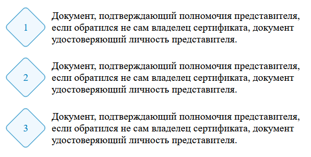

# Стилизованный ромбами список

Способ применения:

- подключить `rombus-list.css`:

```html
<link rel="stylesheet" href="./css/rombus-list.css?v=1.0.0" />
```

- создать в HTML создать блок:

```html
<div class="romber">
  <div class="romber-bg"><span class="romber-item">1</span></div>
  <span class="romber-text">Первый элемент</span>
</div>
```

Пример оформления (скриншот):


