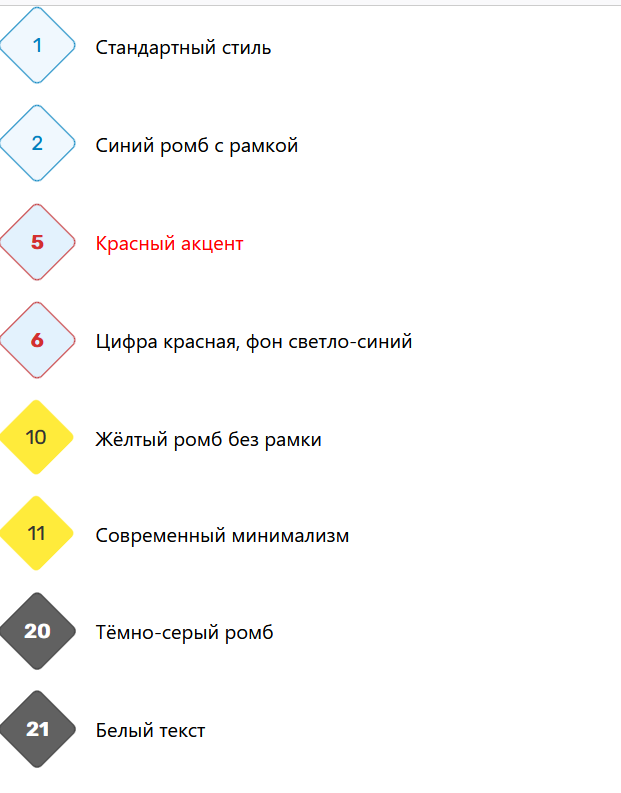

# Кастомный html элемент rombus-list

Способ применения:

- подключить `rombus-list.js`:

```html
<script type="module" src="./js/rombus-list.js?v=1.1.0"></script>
```

- создать в HTML кастомный элемент `<rombus-list></rombus-list>`:

```html
<rombus-list>
    <li>Документ, удостоверяющий личность и&nbsp;гражданство заёмщика.</li>
    <li>Свидетельства о&nbsp;рождении детей / свидетельства об&nbsp;усыновлении / решения суда об&nbsp;усыновлении.</li>
    <li>Паспорт гражданина Российской Федерации, в&nbsp;случае достижения детьми заявителя возраста 14&nbsp;лет.</li>
    <li>СНИЛС заявителя и&nbsp;СНИЛС детей заявителя.</li>
    <li>Кредитный договор, в&nbsp;том числе, первоначальный и&nbsp;все последующие договоры в&nbsp;случае рефинансирования.</li>
    <li>
        Документы о&nbsp;приобретении недвижимости:
    </li>
</rombus-list>
```

- в случае необходимости начала нумерного списка с произвольного номера, требуется указать `start`:

```html
<rombus-list start="10">
    <li>Десятый элемент</li>
    <li>Одиннадцатый элемент</li>
</rombus-list>
```

- для дополнительной стилизации (задания произвольных цветов) фона ромба, номера, жирности, рамки, а также ширины наличия рамки и её ширины, использутся атрибуты `start` `bg-color` `text-color` `border-color` `border`, например:
```html
<!-- Кастомные цвета -->
<rombus-list start="5" bg-color="#e3f2fd" text-color="#d32f2f" border-color="#c62828" font-weight="700">
    <li><span style="color:red;">Красный акцент</span></li>
    <li>Цифра красная, фон светло-синий</li>
</rombus-list>

<!-- Без рамки -->
<rombus-list start="10" bg-color="#ffeb3b" text-color="#333" border="false">
    <li>Жёлтый ромб без рамки</li>
    <li>Современный минимализм</li>
</rombus-list>

<!-- Тёмный режим -->
<rombus-list start="20" bg-color="#616161" text-color="#fff" border-color="#424242" font-weight="700">
    <li>Тёмно-серый ромб</li>
    <li>Белый текст</li>
</rombus-list>
```

Пример оформления (скриншот):

