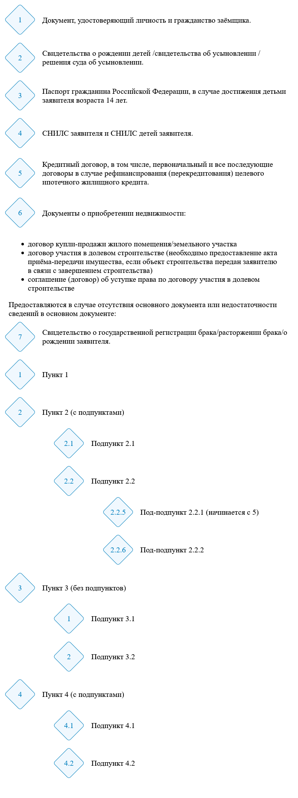

# Стилизованный ромбами нумерованный список

## Ветка hierarchic для вложенных списков

Способ применения:

- подключить `rombus-list.js`:

```html
<script type="module" src="./js/rombus-list.js"></script>
```

- создать в HTML нумерованный список, стилизованный классом `romb-ol`:

```html
<div style="overflow-x: hidden; overflow-wrap: break-word; padding: 10px;">
  <p>Предоставляются в случае отсутствия основного документа или недостаточности сведений в основном документе:</p>

  <ol class="romb-ol" data-start="7">
    <li>Свидетельство о государственной регистрации брака/расторжении брака/о рождении заявителя.</li>
  </ol>

  <ol class="romb-ol" data-start="1">
    <li>Пункт 1</li>
    <li>
      Пункт 2 (с подпунктами)
      <ol class="romb-ol" data-start="1" data-hierarchic="true">
        <li>Подпункт 2.1</li>
        <li>
          Подпункт 2.2
          <ol class="romb-ol" data-start="5">
            <li>Под-подпункт 2.2.1 (начинается с 5)</li>
            <li>Под-подпункт 2.2.2</li>
          </ol>
        </li>
      </ol>
    </li>
    <li>
      Пункт 3 (без подпунктов)
      <ol class="romb-ol" data-start="1">
        <li>Подпункт 3.1</li>
        <li>Подпункт 3.2</li>
      </ol>
    </li>
    <li>
      Пункт 4 (с подпунктами)
      <ol class="romb-ol" data-start="1" data-hierarchic="true">
        <li>Подпункт 4.1</li>
        <li>Подпункт 4.2</li>
      </ol>
    </li>
  </ol>
</div>
```

- в случае необходимости начала нумерного списка с произвольного номера, требуется указать атрибут `data-start`:

```html
<ol class="romb-ol" data-start="7">
  <li>Свидетельство о государственной регистрации брака/расторжении брака/о рождении заявителя.</li>
</ol>
```

- для указания типа нумерации (обычная / иерархическая), требуется указать атрибут `data-hierarchic="true"`

### Особенности:

- CSS-стили подключаются автоматически в head
- для предотвращения появления горизонтального скролла необходимо добавить контейнер обёртку и назначить ей стили:

```html
<div style="overflow-x: hidden; overflow-wrap: break-word; padding: 10px;"></div>
```

Пример оформления (скриншот):


