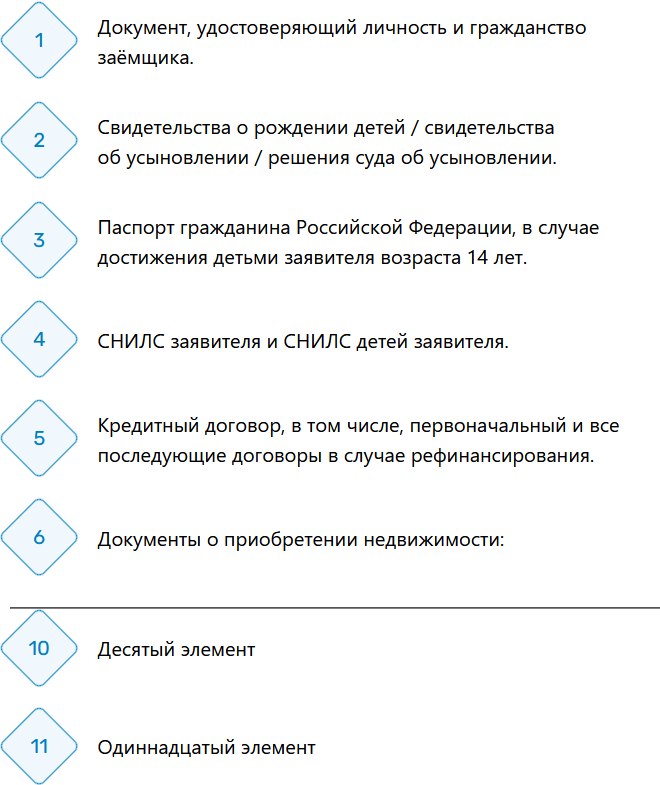

# Кастомный html элемент rombus-list

Способ применения:

- подключить `rombus-list.js`:

```html
<script type="module" src="./js/rombus-list.js?v=1.0.0"></script>
```

- создать в HTML кастомный элемент `<rombus-list></rombus-list>`:

```html
<rombus-list>
    <li>Документ, удостоверяющий личность и&nbsp;гражданство заёмщика.</li>
    <li>Свидетельства о&nbsp;рождении детей / свидетельства об&nbsp;усыновлении / решения суда об&nbsp;усыновлении.</li>
    <li>Паспорт гражданина Российской Федерации, в&nbsp;случае достижения детьми заявителя возраста 14&nbsp;лет.</li>
    <li>СНИЛС заявителя и&nbsp;СНИЛС детей заявителя.</li>
    <li>Кредитный договор, в&nbsp;том числе, первоначальный и&nbsp;все последующие договоры в&nbsp;случае рефинансирования.</li>
    <li>
        Документы о&nbsp;приобретении недвижимости:
    </li>
</rombus-list>
```

- в случае необходимости начала нумерного списка с произвольного номера, требуется указать `start`:

```html
<rombus-list start="10">
    <li>Десятый элемент</li>
    <li>Одиннадцатый элемент</li>
</rombus-list>
```

Пример оформления (скриншот):

