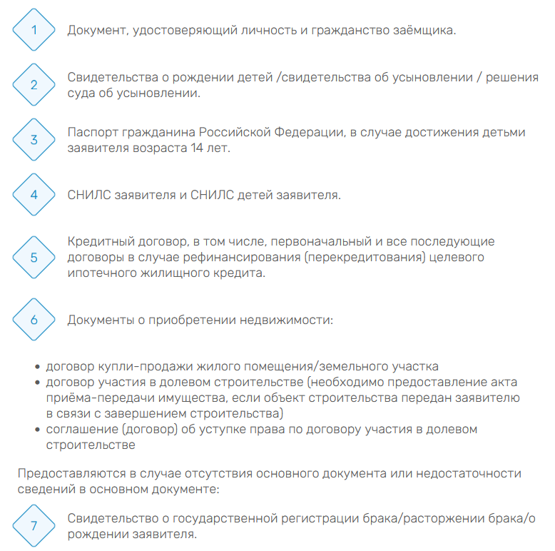

# Стилизованный ромбами нумерованный список

Способ применения:

- подключить `rombus-list.js`:

```html
<script type="module" src="./js/rombus-list.js"></script>
```

- создать в HTML нумерованный список, стилизованный классом `romb-ol`:

```html
<script type="module" src="./faq-ipoteka/js/rombus-list/rombus-list.js"></script>
<ol class="romb-ol">
  <li>Документ, удостоверяющий личность и гражданство заёмщика.</li>
  <li>Свидетельства о рождении детей /свидетельства об усыновлении / решения суда об усыновлении.</li>
  <li>Паспорт гражданина Российской Федерации, в случае достижения детьми заявителя возраста 14 лет.</li>
  <li>СНИЛС заявителя и СНИЛС детей заявителя.</li>
  <li>
    Кредитный договор, в том числе, первоначальный и все последующие договоры в случае рефинансирования (перекредитования) целевого ипотечного
    жилищного кредита.
  </li>
  <li>
    <div>Документы о приобретении недвижимости:</div>
  </li>
</ol>
```

- в случае необходимости начала нумерного списка с произвольного номера, требуется указать `data-start`:

```html
<ol class="romb-ol" data-start="7">
  <li>Свидетельство о государственной регистрации брака/расторжении брака/о рождении заявителя.</li>
</ol>
```

### Особенности:
- CSS-стили подключаются автоматически в head

Пример оформления (скриншот):


